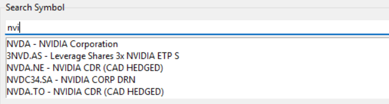
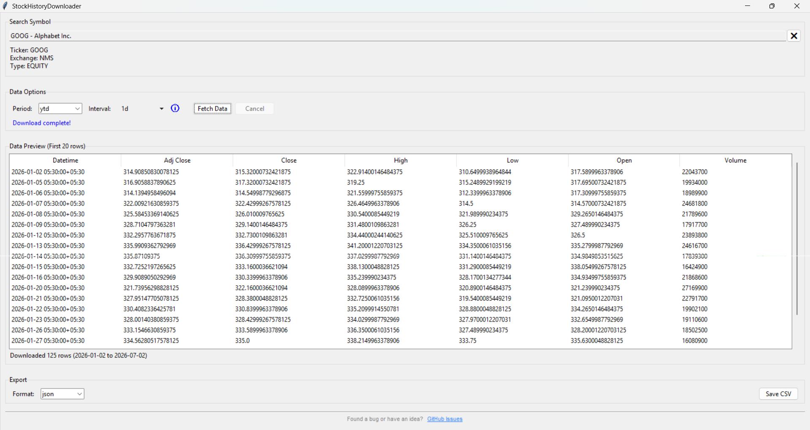

# StockHistoryDownloader

A polished, professional-quality Windows desktop utility for searching, previewing, and downloading historical stock data using Yahoo Finance.

## Screenshots

**Smart Symbol Search** — type a company name or ticker and get instant autocomplete suggestions with exchange info:



**Full Application View** — search, fetch, preview data, and export to CSV or JSON in one clean window:



## Features

- **Smart Search**: Search symbols with instant suggestion dropdowns and detailed metadata (Exchange, Quote Type, Currency).
- **Interactive UI**: Native window design using Tkinter & TTK.
- **Dynamic validation**: Period and Interval selectors dynamically adjust to ensure only valid Yahoo Finance request configurations can be chosen (e.g. preventing invalid combinations of short intervals over large periods).
- **Fetch & Preview**: Download data on background threads (so the UI never freezes) and preview the first 20 rows alongside total statistics before saving.
- **Export Formats**: Export data cleanly to CSV or JSON (with metadata).
- **Post-Save Actions**: Instantly open the exported file or folder directly from the success screen.
- **Search History**: Saves your last 10 successful searches locally inside `config.json`.

## Project Structure

```text
StockDownloader/
├── main.py          # Application entrypoint
├── build.bat        # PyInstaller packaging script
├── api/             # API layer (Yahoo Finance Search & Fetch wrapper)
├── gui/             # GUI components (Main window, Custom widgets, Dialogs)
├── models/          # Data models (Search results, App configurations)
├── utils/           # Utilities (Exporter, Logger, Configuration, Validator)
└── tests/           # Unit tests
```

## Running Locally

1. Install Python 3.8+
2. Install the dependencies:
   ```bash
   pip install pandas yfinance requests
   ```
3. Run the application:
   ```bash
   python main.py
   ```
## Download

**[Download the latest version](https://github.com/PrincejiCoder/StockHistoryDownloader/releases/latest)**

## License

This project is open-source and available under the MIT License.
